# 天候と服装のシステム

> 気温・天気・湿度をもとに、その日に適した服装を提案するWebアプリ（プロトタイプ）のドキュメント

---

## 目次

1. [プロジェクト概要](#1-プロジェクト概要)
2. [技術スタック](#2-技術スタック)
3. [機能一覧](#3-機能一覧)
4. [機能要求・非機能要求](#4-機能要求非機能要求)
5. [ユースケース](#5-ユースケース)
6. [モジュール構成](#6-モジュール構成)
7. [シーケンス図](#7-シーケンス図)
8. [状態遷移図](#8-状態遷移図)
9. [使用プラットフォーム](#9-使用プラットフォーム)

---

## 1. プロジェクト概要

### アプリ名
天候と服装のシステム（プロトタイプ）

### 目的
気温・天気・湿度をもとに、ルールベースでその日に適した服装を提案するWebアプリ。気温・天気・湿度は、Open-Meteo APIを使った現在地の天気の自動取得、またはフォームへの手入力のどちらでも指定できる。さらに、朝・昼・夜3時点の天気をまとめて取得し時間帯別に提案することもできる。気に入った提案は「お気に入り」としてブラウザのlocalStorageに保存でき、保存済みの内容をフォームに呼び戻して再利用することもできる。

### 現在の実装範囲
- 天気・気温・湿度は**フォームへの手入力**、または**Open-Meteo API（外部の無料天気API）を使った自動取得**のいずれかで入力できる
- 自動取得は「現在地の天気を自動取得する」ボタン1つで、位置情報取得→Open-Meteo API呼び出し→フォームへの自動反映までを行う（送信するのは緯度・経度のみ）
- 「朝・昼・夜の服装を提案する」ボタンで、Open-Meteoの時間帯別（1時間ごと）予報から朝8時・昼14時・夜20時の代表値を取得し、3件の服装提案を一度に表示する
- お気に入り一覧の各項目に「この内容で再入力」ボタンがあり、保存済みの気温・天気・湿度をフォームへ復元して再利用できる
- 位置情報の取得（画面表示用）は服装提案フローと独立した機能としても引き続き利用できる
- フレームワークを使わないVanilla JavaScript（ES Modules）で実装
- ビルドツール・バンドラーは使用せず、静的ファイルをそのままブラウザで実行する

### 作らないもの・未実装のもの（非目標）
- PWA化（Service Worker・manifest.json・オフライン対応・ホーム画面インストール）
- React等のフレームワーク導入
- 服装のコーディネート画像表示・ブランド推薦
- 週間予報・降水確率の表示
- 複数デバイス間のデータ同期・クラウド保存
- ユーザー認証

---

## 2. 技術スタック

| 項目 | 内容 |
|------|------|
| フレームワーク | なし（Vanilla JavaScript / ES Modules） |
| ビルドツール | なし（静的ファイルをそのまま配信） |
| 対応プラットフォーム | モダンブラウザ（Chrome / Firefox / Safari / Edge） |
| 天気データ | [Open-Meteo](https://open-meteo.com/)（APIキー不要・無料）による自動取得、またはフォームへの手入力（併用可） |
| ローカル保存 | localStorage（Web Storage API）— お気に入りのみ |
| 位置情報取得 | Geolocation API（ブラウザ標準）— 画面表示のみ |
| バックエンド | なし（クライアントサイドのみ） |
| PWA対応 | 未実装 |

### ファイル構成

```
apri2/
├── index.html                # ルート：weather-outfit/へのリダイレクトページ
└── weather-outfit/
    ├── index.html             # メイン画面
    ├── style.css               # スタイル
    └── js/
        ├── app.js               # エントリーポイント（各UIの初期化）
        ├── events.js             # モジュール間で使う共通イベント名
        ├── validation.js         # フォーム入力値のバリデーション
        ├── outfitRules.js        # 服装レコメンドロジック（ルールベース）
        ├── favorites.js          # お気に入りのlocalStorageリポジトリ（保存・削除時にEVENT_FAVORITES_UPDATEDを発火）
        ├── geolocation.js        # Geolocation APIのラッパー
        ├── weatherApi.js         # Open-Meteo APIのラッパー（現在の天気・時間帯別予報の取得）
        └── ui/
            ├── locationUI.js      # 「位置情報の観測」のUI制御
            ├── autoFillUI.js      # 「現在地の天気を自動取得してフォームに反映」のUI制御
            ├── timeOfDayUI.js     # 「朝・昼・夜の服装提案」のUI制御
            ├── outfitFormUI.js    # 「入力フォーム→服装提案」のUI制御
            └── favoritesUI.js     # 「お気に入り登録・一覧・削除・再利用」のUI制御
```

---

## 3. 機能一覧

### コア機能

| 機能名 | 概要 |
|--------|------|
| 気温・天気・湿度の入力 | ユーザーがフォームに気温（-30〜45℃）・天気（晴れ/曇り/雨/雪）・湿度（0〜100%）を入力する |
| 天気の自動取得 | 現在地の緯度・経度をもとにOpen-Meteo APIから気温・湿度・天気を取得し、フォームへ自動反映する |
| 朝・昼・夜の服装提案 | Open-Meteoの時間帯別予報から朝8時・昼14時・夜20時の代表値を取得し、3件の服装提案を同時に表示する |
| 入力バリデーション | 未入力・範囲外・不正な値をフィールドごとにエラー表示する |
| 服装レコメンド表示 | 入力値をルールベースで判定し、基本の服装＋天気・湿度に応じた追加アドバイスを表示する |
| 位置情報の取得・表示 | ブラウザのGeolocation APIで現在地の緯度・経度・取得精度を取得し画面に表示する |

### サポート機能

| 機能名 | 概要 |
|--------|------|
| お気に入り登録 | 直前に生成された服装提案（入力値＋提案内容）を1件保存する。朝・昼・夜の提案は時間帯ラベル付きで保存できる |
| お気に入り一覧・削除 | 保存済みの提案を新しい順に一覧表示し、個別に削除できる |
| お気に入りの編集 | 保存済みの提案（気温・天気・湿度・まとめ・服装・ポイント）をその場で編集して上書き保存できる |
| お気に入りの再利用 | 保存済みの気温・天気・湿度をフォームに復元し、同じ条件で再度提案を確認できる |

### 共通機能

| 機能名 | 概要 |
|--------|------|
| フォームエラー表示 | フィールド単位・フォーム全体のエラーメッセージ表示（role="alert"） |
| ステータス表示 | 位置情報取得中／成功／失敗、お気に入り保存成功などのステータスをaria-live領域で通知 |

---

## 4. 機能要求・非機能要求

### 機能要求

システムが「何をするか」を定義する。

| 機能名 | 内容 | 分類 |
|--------|------|------|
| 位置情報取得 | ブラウザのGeolocation APIで現在地の緯度・経度・精度を取得し表示する | コア |
| 天気の自動取得 | 位置情報をもとにOpen-Meteo APIから気温・湿度・天気を取得し、フォームへ自動入力する | コア |
| 朝・昼・夜の服装提案 | 位置情報をもとにOpen-Meteoの時間帯別予報を取得し、朝・昼・夜3件の服装提案を生成する | コア |
| 気温・天気・湿度の入力 | フォームで数値・選択肢を受け取り、範囲外や未入力を検証する | コア |
| 服装レコメンド表示 | 気温帯ルール＋天候・湿度アドバイスを組み合わせて提案を生成する | コア |
| お気に入り登録 | 直前の提案内容（入力値＋提案文、任意で時間帯ラベル）を1件localStorageへ保存する | サポート |
| お気に入り一覧・削除 | 保存済みの提案を一覧表示し個別に削除できる | サポート |
| お気に入りの編集 | 保存済みのお気に入り（気温・天気・湿度・まとめ・服装・ポイント）をその場で編集し上書き保存する | サポート |
| お気に入りの再利用 | 保存済みの気温・天気・湿度をフォームの入力欄に復元する | サポート |

### 非機能要求

システムが「どのように動くか」を定義する。

#### 性能

| 要求 | 基準・根拠 |
|------|-----------|
| フォーム送信から提案表示まで即時（100ms以内、手動入力時） | 外部通信を行わずクライアント内のルール判定のみで完結するため |
| 天気自動取得は3秒以内に完了する | 位置情報取得＋Open-Meteo APIレスポンス時間の合計を考慮 |
| 朝・昼・夜の服装提案は3秒以内に完了する | 位置情報取得＋Open-Meteo時間帯別予報（1回のAPI呼び出し）のレスポンス時間を考慮 |
| お気に入りの読み込みは即時（500ms以内） | localStorageはI/O待ちなしで読み込める |
| お気に入りの再利用はクリック直後に反映される（100ms以内） | localStorageに保存済みの値をフォームへ直接コピーするだけで完結するため |

#### セキュリティ

| 要求 | 基準・根拠 |
|------|-----------|
| 天気自動取得時に送信する情報を緯度・経度のみに限定する | Open-Meteo APIへのリクエストパラメータは緯度・経度のみで、氏名や端末情報などは含めない |
| 位置情報・入力値・お気に入りデータをOpen-Meteo以外の外部へ送信しない | 天気取得以外の外部通信は行わず、それ以外はすべてブラウザ内で完結する |
| お気に入りデータはlocalStorageにのみ保存 | クラウド送信・外部共有なし |
| 位置情報取得はブラウザの許可ダイアログを通じて行う | Geolocation APIの仕様に準拠 |
| 天気取得はHTTPS経由のみで行う | Open-Meteo APIのHTTPSエンドポイントのみを使用する |

#### ユーザビリティ

| 要求 | 基準・根拠 |
|------|-----------|
| 主要操作は3クリック以内で完結する | 入力→提案確認、提案確認→お気に入り登録の両導線 |
| エラー状態を必ず画面上に示す | フィールドエラー・フォーム全体エラーをrole="alert"で通知 |
| PC・スマホブラウザ両方でレスポンシブ対応する | CSSのみで最大幅640pxのカードレイアウトを実装 |

#### 保守性

| 要求 | 基準・根拠 |
|------|-----------|
| 服装提案ロジックを独立したファイルに分離する | `outfitRules.js`を変更すればUIコンポーネントを触らずにルール変更できる |
| バリデーションロジックを独立したファイルに分離する | `validation.js`単体でテスト・変更が可能 |
| 天気取得ロジックを`weatherApi.js`に分離する | APIプロバイダの変更やレスポンス形式の変更時に、UIコード（`autoFillUI.js` / `timeOfDayUI.js`）を触らずに対応できる |
| UIモジュールを機能単位で分割する | `locationUI.js` / `autoFillUI.js` / `timeOfDayUI.js` / `outfitFormUI.js` / `favoritesUI.js`に分離し責務を限定 |
| モジュール間の連携はカスタムイベントで疎結合にする | `events.js`の`outfit:generated`イベントで提案生成を、`favorites:updated`イベントでお気に入り更新をそれぞれ通知し、DOMや内部状態を直接触らずに連携する |
| お気に入りの保存元を問わず一覧表示を自動更新する | `favorites.js`が保存・削除のたびに`favorites:updated`を発火するため、`outfitFormUI.js`経由でも`timeOfDayUI.js`経由でも`favoritesUI.js`側の再描画コードを個別に呼ぶ必要がない |

---

## 5. ユースケース

アクターは2つ。「ユーザー」が主アクター、「ブラウザ Geolocation API」と「Open-Meteo API」が外部システムとしての副アクター。

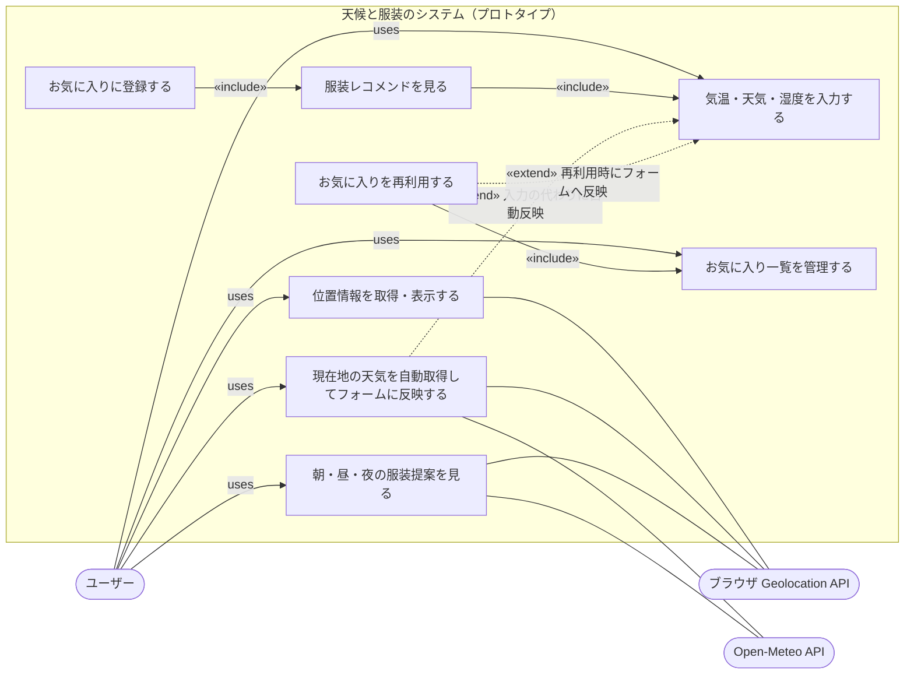

### 矢印の読み方

- **実線 `«include»`** — 必ず呼び出される関係（服装提案は必ずフォーム入力を内包し、お気に入り登録は必ず提案生成を内包する。お気に入りの再利用（UC8）は一覧管理（UC5）を内包する）
- **点線 `«extend»`** — 条件付きで発生する関係（天気自動取得（UC6）やお気に入り再利用（UC8）を使った場合のみ、手入力の代わりにフォームへ値が自動反映される）
- UC6・UC7はGeolocation APIとOpen-Meteo APIの両方を利用する独立機能で、使わずにUC2（手動入力）のみで完結することもできる
- UC7（朝・昼・夜の服装提案）はUC2〜UC4のフォーム入力フローとは独立しており、結果は直接お気に入りに追加できる

---

## 6. モジュール構成

> フレームワークやクラス構文（`class`）は使用しておらず、各ファイルはES Modulesとしてエクスポートした関数の集合になっている。以下は各モジュールが公開する関数と依存関係を示す。

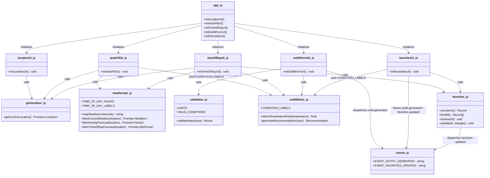

### 依存の説明

| モジュール | 役割 |
|------------|------|
| `app.js` | エントリーポイント。5つのUIモジュールを初期化するだけの「つなぎ役」 |
| `locationUI.js` / `autoFillUI.js` / `timeOfDayUI.js` / `outfitFormUI.js` / `favoritesUI.js` | 機能ごとのDOM操作を担当するUI制御層 |
| `geolocation.js` / `weatherApi.js` / `validation.js` / `outfitRules.js` / `favorites.js` | UIから独立したロジック層（外部API連携・ルール・検証・永続化） |
| `events.js` | UIモジュール間の連携に使う共通イベント名の定義（疎結合化） |

`favorites.js`は保存・削除のたびに`favorites:updated`を発火する。`favoritesUI.js`はこのイベントを購読して一覧を再描画するだけなので、`outfitFormUI.js`経由（手動入力の結果を保存）でも`timeOfDayUI.js`経由（朝・昼・夜の提案を保存）でも、保存元を意識せずに一覧が自動更新される。

---

## 7. シーケンス図

### UC1：位置情報の取得・表示

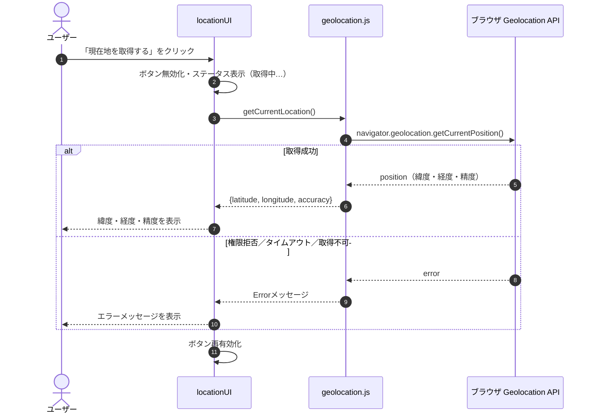

### UC6：現在地の天気自動取得（Open-Meteo連携）

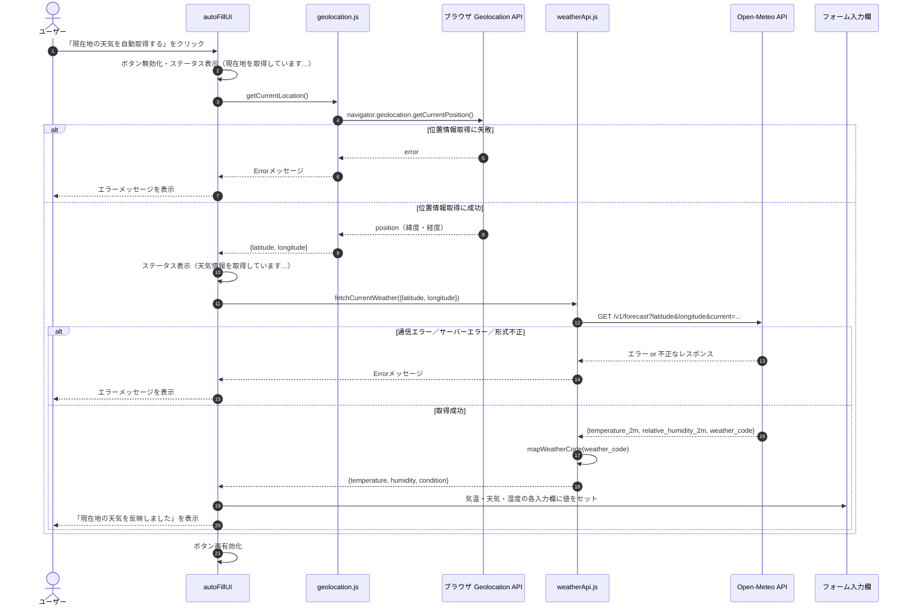

### UC7：朝・昼・夜の服装提案

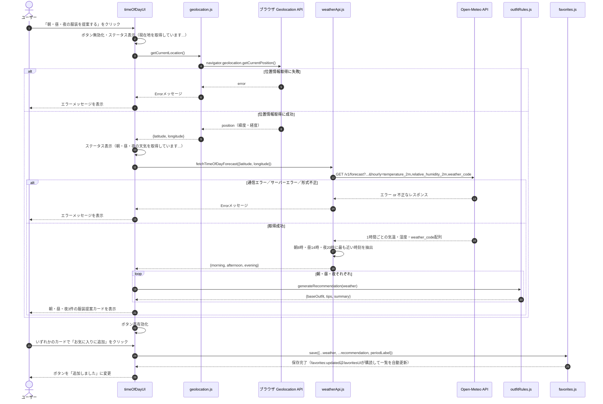

### UC2・UC3：気温・天気・湿度の入力→服装レコメンド表示

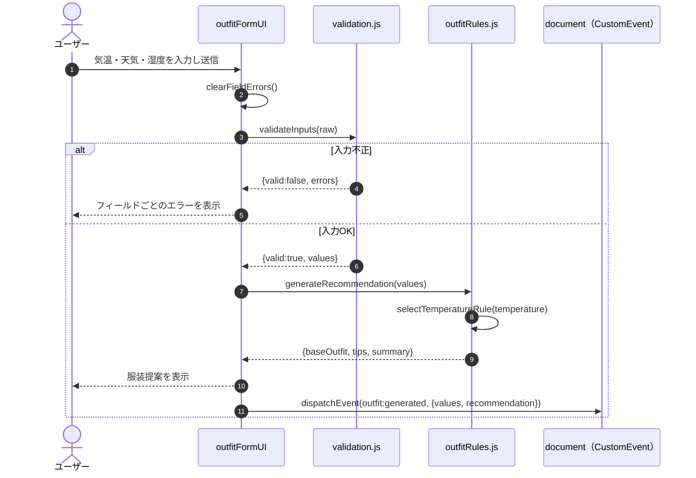

### UC4：お気に入り登録

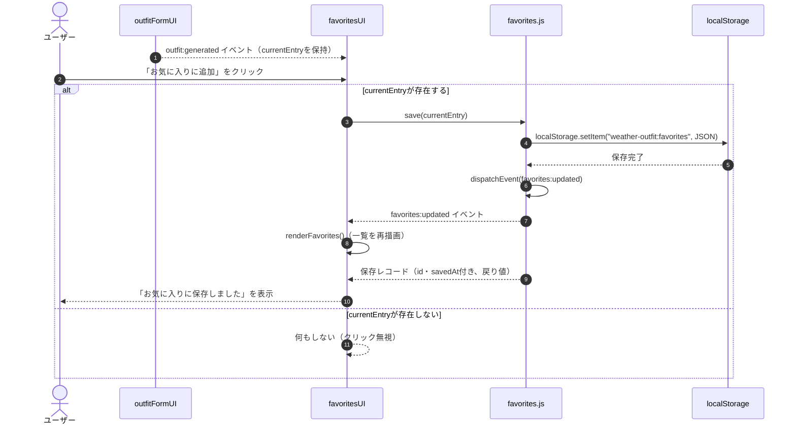

### UC5：お気に入り管理（一覧・削除）

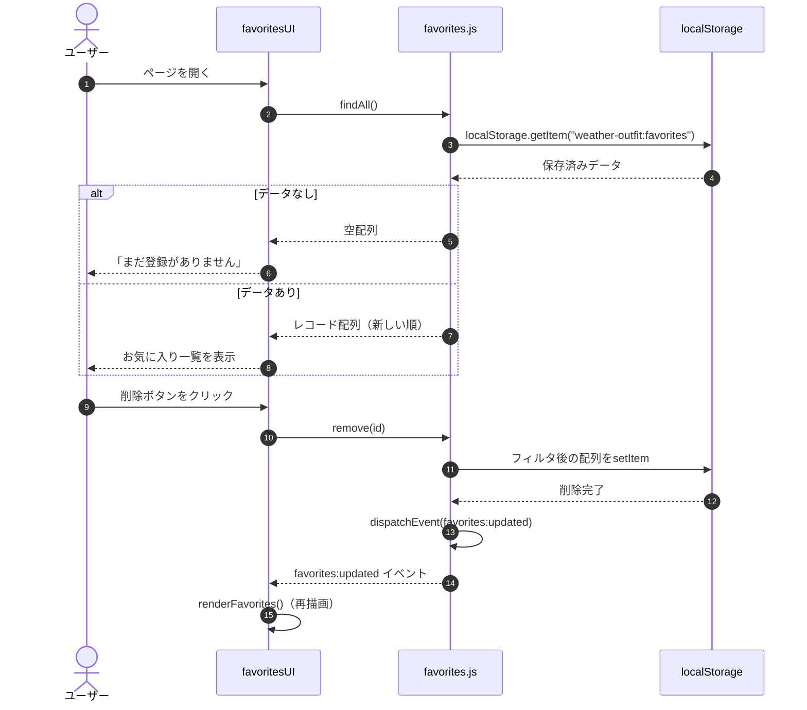

### UC8：お気に入りの再利用

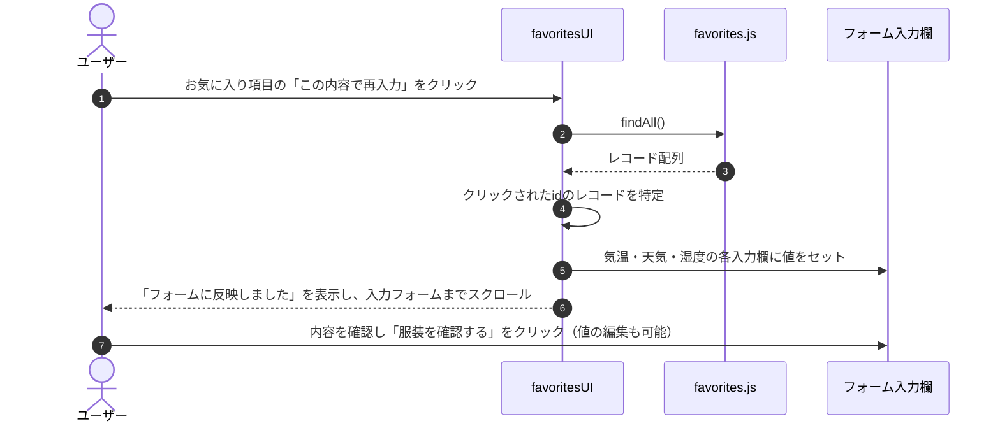

---

## 8. 状態遷移図

### 位置情報取得（locationUI）

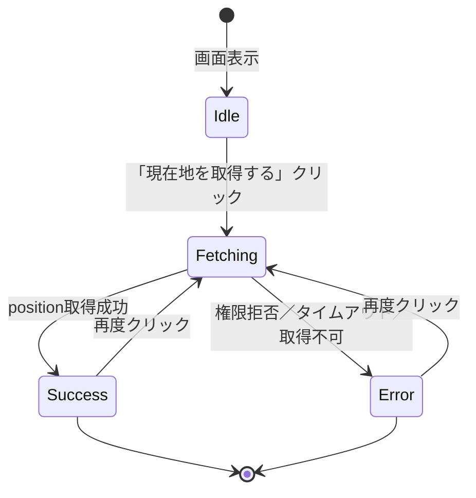

### 天気自動取得（autoFillUI）

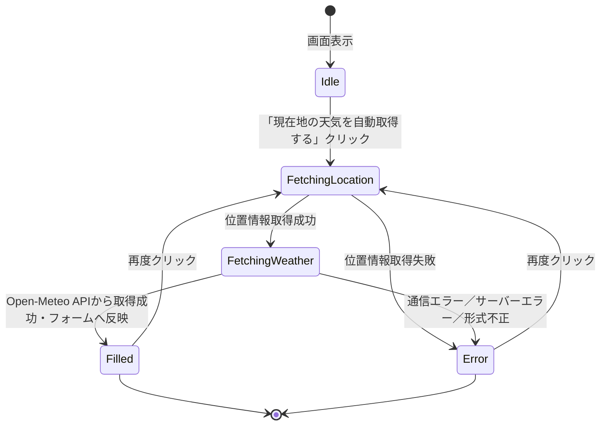

### 朝・昼・夜の服装提案（timeOfDayUI）

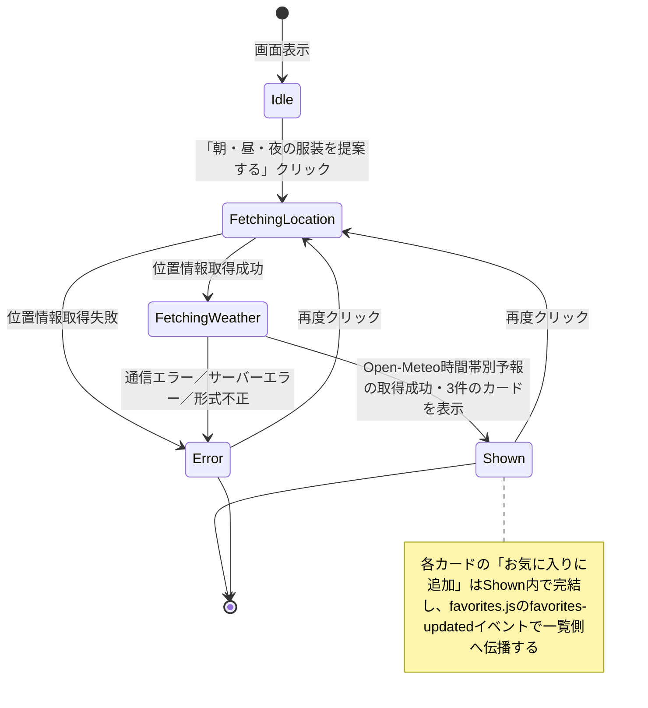

### 服装提案フォーム（outfitFormUI）

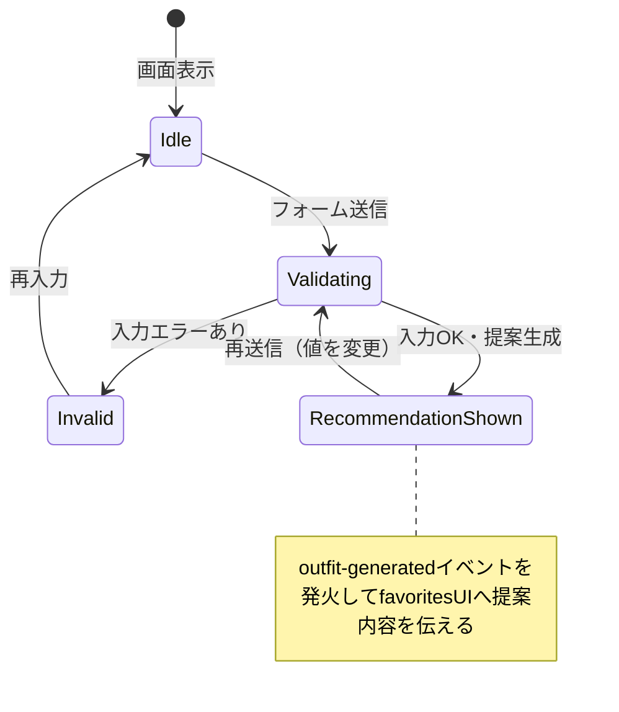

### お気に入り（favoritesUI）

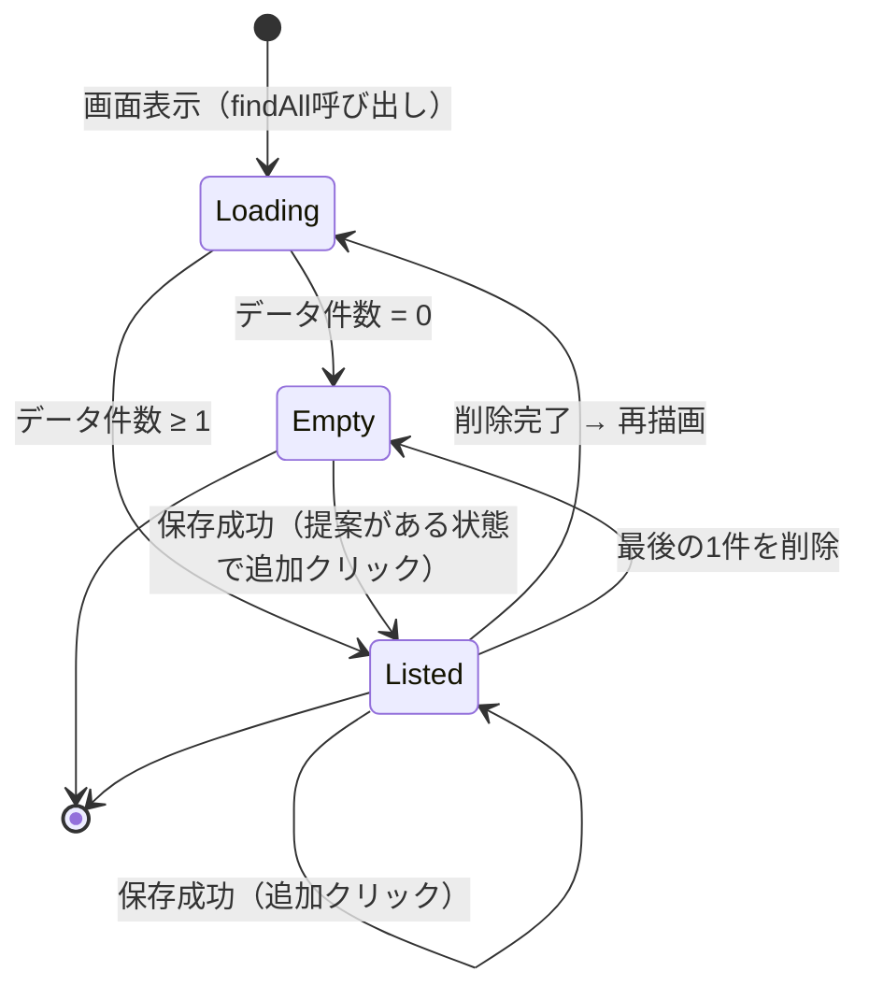

---

## 9. 使用プラットフォーム

| ツール | 用途 |
|--------|------|
| [Claude（claude.ai）](https://claude.ai) | 要件のヒアリング・初期ドキュメント作成・実装コードの精査・機能追加支援・本ドキュメントの更新 |
| [Open-Meteo](https://open-meteo.com/) | 天気予報データ（現在の天気・1時間ごとの時間帯別予報）の取得（APIキー不要・無料） |
| [Mermaid.js](https://mermaid.js.org/) | ユースケース図・モジュール構成図・シーケンス図・状態遷移図のレンダリング |

本ドキュメントは当初React PWAとしての要件定義書として作成されたが、実際の実装はフレームワーク・PWAを伴わないVanilla JavaScriptのプロトタイプとなったため、実装内容に合わせて全面的に更新した。その後、Open-Meteo APIと連携した天気自動取得機能（UC6・`weatherApi.js`・`autoFillUI.js`）を追加し、続けて朝・昼・夜の時間帯別提案（UC7・`timeOfDayUI.js`）とお気に入りの再利用（UC8）を追加し、関連するドキュメントと図をその都度更新した。さらに、お気に入り登録の重複防止とお気に入り項目のインライン編集機能（`favorites.js`の`update`関数・`favoritesUI.js`の編集フォーム）を追加し、機能一覧・機能要求・モジュール構成をそれぞれ更新した。

---
