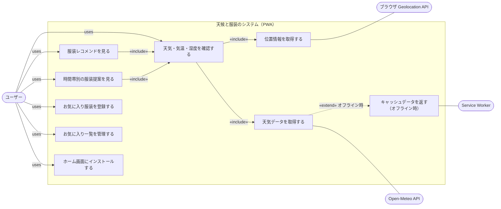
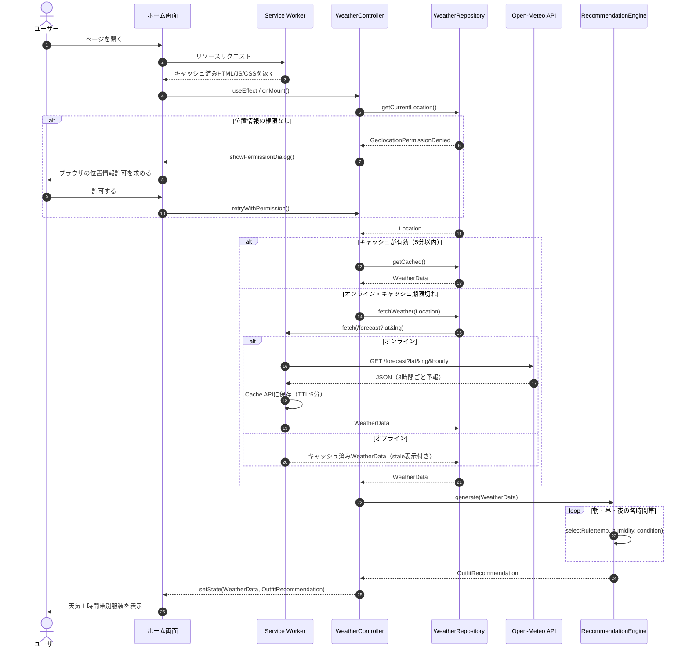
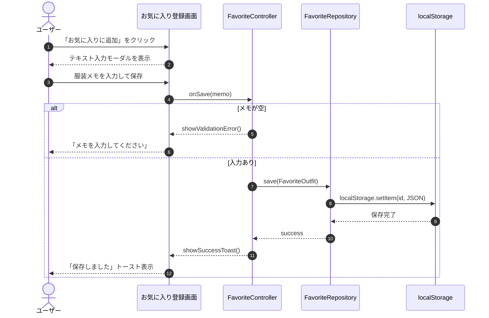
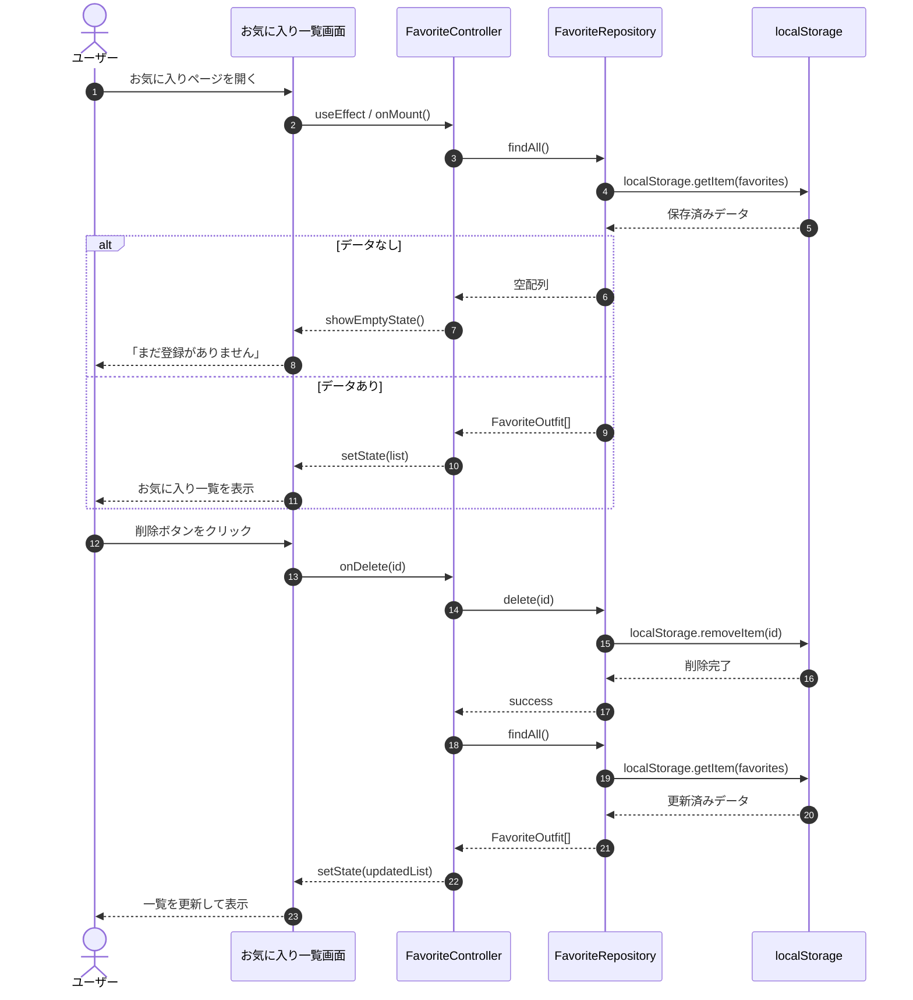
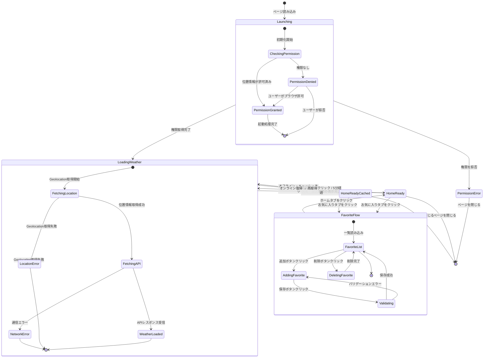
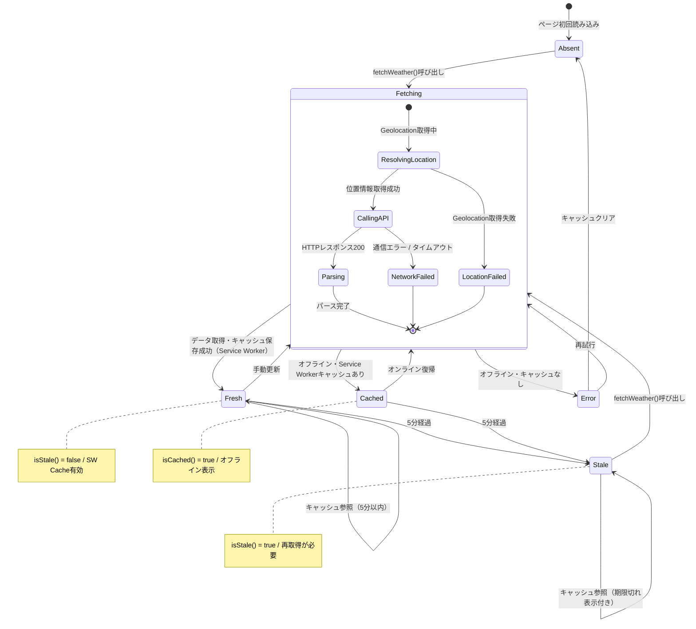
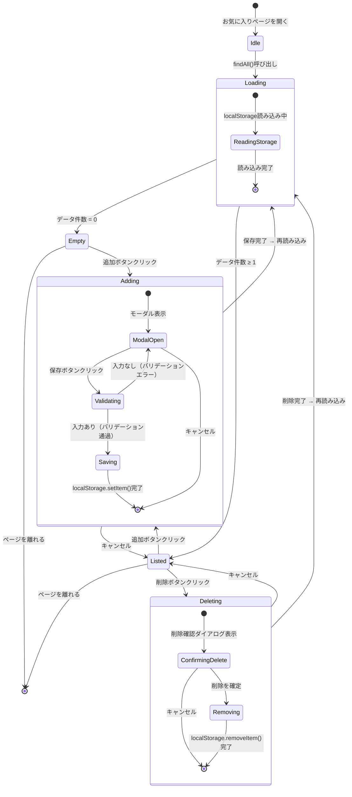

# 天候と服装のシステム

> 天気・気温・湿度をもとに、その日に適した服装を提案するReact PWA（Progressive Web App）の要件定義ドキュメント

---

## 目次

1. [プロジェクト概要](#1-プロジェクト概要)
2. [技術スタック](#2-技術スタック)
3. [機能一覧](#3-機能一覧)
4. [機能要求・非機能要求](#4-機能要求非機能要求)
5. [ユースケース](#5-ユースケース)
6. [クラス設計](#6-クラス設計)
7. [シーケンス図](#7-シーケンス図)
8. [状態遷移図](#8-状態遷移図)
9. [使用プラットフォーム](#9-使用プラットフォーム)

---

## 1. プロジェクト概要

### アプリ名
天候と服装のシステム

### 目的
天気・気温・湿度をもとに、その日に適した服装をユーザーに提案するReact PWA（Progressive Web App）を開発する。朝・昼・夜の時間帯別に提案を行い、ユーザーが気に入った服装をメモとしてブラウザのローカルストレージに保存できる。Service Workerによるオフライン対応とホーム画面へのインストール（Add to Home Screen）に対応する。

### 作らないもの（非目標）
- 服装のコーディネート画像表示・ブランド推薦
- 週間予報・降水確率の表示
- 手動での都市名検索・時間帯のカスタマイズ
- 複数デバイス間のデータ同期・クラウド保存
- ユーザー認証

---

## 2. 技術スタック

| 項目 | 内容 |
|------|------|
| フレームワーク | React（JavaScript / TypeScript） |
| PWA対応 | Vite PWA Plugin または Create React App（Workbox） |
| 対応プラットフォーム | モダンブラウザ（Chrome / Firefox / Safari / Edge）+ ホーム画面インストール |
| 天気データAPI | [Open-Meteo](https://open-meteo.com/)（APIキー不要・完全無料） |
| ローカル保存 | localStorage（Web Storage API） |
| オフラインキャッシュ | Service Worker + Cache API（Workbox） |
| バックエンド | なし（クライアントサイドのみ） |
| 位置情報取得 | Geolocation API（ブラウザ標準） |

### PWA必須ファイル

| ファイル | 役割 |
|----------|------|
| `manifest.json` | アプリ名・アイコン・テーマカラー・表示モードを定義 |
| `service-worker.js` | リソースのキャッシュ戦略・オフライン対応を実装 |
| アイコン画像 | 192×192px / 512×512px の PNG（インストール時に使用） |

### Workbox キャッシュ戦略

| 対象 | 戦略 | 理由 |
|------|------|------|
| HTML / JS / CSS | Cache First | 静的リソースは変化が少ない |
| Open-Meteo API | Network First（5分TTL） | 天気データは鮮度が重要 |
| アイコン・画像 | Cache First | 変化しないため積極的にキャッシュ |

### Open-Meteo APIエンドポイント例

```
GET https://api.open-meteo.com/v1/forecast
  ?latitude={lat}
  &longitude={lng}
  &hourly=temperature_2m,relativehumidity_2m,weathercode
```

---

## 3. 機能一覧

### コア機能（優先度：高）

| 機能名 | 概要 |
|--------|------|
| 天気データ取得 | Open-Meteo APIから気温・湿度・天気状態を取得する |
| 服装レコメンド表示 | 気象データをルールベースで判定し服装を提案する |
| 時間帯別提案（朝・昼・夜） | 3時間予報から朝昼夜ごとに服装を提示する |

### サポート機能（優先度：中）

| 機能名 | 概要 |
|--------|------|
| お気に入り登録 | ユーザーが任意のテキストを服装メモとして保存する |
| お気に入り一覧・削除 | 保存済みメモを一覧表示し個別に削除できる |
| オフライン時キャッシュ表示 | Service Workerが直前の天気データをキャッシュし、オフライン時も表示する |
| ローカルデータ永続化 | localStorage でブラウザ内に保存する |
| ホーム画面インストール | manifest.jsonによりAdd to Home Screenを促すバナーを表示する |

### 共通機能

| 機能名 | 優先度 | 概要 |
|--------|--------|------|
| 位置情報取得（Geolocation API） | 高 | ブラウザのGeolocation APIで現在地の緯度・経度を取得する |
| Service Worker登録 | 高 | Workboxでキャッシュ戦略を実装しオフライン対応する |
| Web App Manifest | 高 | アプリ名・アイコン・テーマカラーを定義しインストール可能にする |
| ページナビゲーション | 中 | 画面間の遷移（React Router 等） |
| インストールバナー | 中 | beforeinstallpromptイベントでAdd to Home Screenを促す |
| ローディング表示 | 低 | API通信中のスピナー・スケルトン |
| ファビコン・OGP設定 | 低 | ブラウザタブのアイコンとSNSシェア時のメタ情報 |

---

## 4. 機能要求・非機能要求

### 機能要求

システムが「何をするか」を定義する。

| 機能名 | 内容 | 分類 |
|--------|------|------|
| 天気データ取得 | Open-Meteo APIから気温・湿度・天気状態を取得する | コア |
| 位置情報取得 | ブラウザのGeolocation APIで現在地の緯度・経度を取得する | コア |
| 服装レコメンド表示 | 気象データをルールベースで判定し服装を提案する | コア |
| 時間帯別提案 | 朝・昼・夜それぞれに異なる服装提案を表示する | コア |
| お気に入り登録 | ユーザーが任意のテキストを服装メモとして保存する | サポート |
| お気に入り一覧・削除 | 保存済みメモを一覧表示し個別に削除できる | サポート |
| オフライン時キャッシュ表示 | Service Workerが直前の天気データを返し画面を表示する | サポート |
| ホーム画面インストール | manifest.jsonとbeforeinstallpromptでインストールを促す | サポート |

### 非機能要求

システムが「どのように動くか」を定義する。

#### 性能

| 要求 | 基準・根拠 |
|------|-----------|
| ページ表示から天気表示まで3秒以内 | Open-Meteo応答速度 + Geolocation取得の合計を考慮 |
| お気に入りの読み込みは即時（500ms以内） | localStorageはI/O待ちなしで読み込める |

#### セキュリティ

| 要求 | 基準・根拠 |
|------|-----------|
| 位置情報はOpen-Meteo以外に送信しない | APIへの送信は緯度経度のみ・匿名 |
| お気に入りデータはlocalStorageにのみ保存 | クラウド送信・外部共有なし |
| 位置情報取得はブラウザの許可ダイアログを通じて行う | Geolocation APIの仕様に準拠（HTTPS必須） |
| 本番環境はHTTPS必須 | Geolocation API・Service Workerの両方がHTTPS環境でのみ動作する |
| Service Workerのスコープを `/` に限定する | 意図しないリソースへのインターセプトを防ぐ |

#### ユーザビリティ

| 要求 | 基準・根拠 |
|------|-----------|
| 主要操作は3クリック以内で完結する | 起動→天気確認、起動→お気に入り登録の両導線 |
| エラー・ローディング状態を必ず画面上に示す | 通信中スピナー、オフライン時メッセージ表示 |
| PC・スマホブラウザ両方でレスポンシブ対応する | CSSメディアクエリまたはTailwind CSSを活用 |

#### 保守性

| 要求 | 基準・根拠 |
|------|-----------|
| 服装提案ロジックを独立したファイルに分離する | ルール変更時にUIコンポーネントを触らなくてよい構造 |
| APIのエンドポイントや閾値は定数として一元管理 | 変更箇所を1ファイルに集約し修正コストを下げる |
| ReactのコンポーネントをAtomicDesign等で分割する | 再利用性と可読性の確保。テスト容易性にも寄与 |
| Service Workerのキャッシュバージョンを定数で管理する | デプロイ時にキャッシュを確実に更新できる構造 |

---

## 5. ユースケース

アクターは3つ定義している。「ユーザー」が主アクター、「ブラウザGeolocation」と「Open-Meteo API」が外部システムとしての副アクターとなる。PWA対応によりオフライン時はService Workerがキャッシュを返すため、UC8はエラーではなくキャッシュ表示に変わる。



### 矢印の読み方

- **実線 `«include»`** — 必ず呼び出される関係（服装提案は必ず天気確認を内包）
- **点線 `«extend»`** — 条件付きで発生する関係（オフライン時のみエラー表示が起動）

---

## 6. クラス設計

> Web版ではDartの型をJavaScript/TypeScriptの型に読み替える。`LocalStorage` クラスはブラウザの `window.localStorage` をラップした実装となる。PWA対応として `ServiceWorkerManager` と `InstallPromptManager` を追加している。

```mermaid
classDiagram
  class Location {
    +number latitude
    +number longitude
    +string cityName
    +Date fetchedAt
    +getCurrentLocation() Promise~Location~
    +isValid() boolean
  }

  class WeatherData {
    +number temperature
    +number humidity
    +string condition
    +Date observedAt
    +HourlyForecast[] hourlyForecasts
    +isStale() boolean
    +isCached() boolean
  }

  class HourlyForecast {
    +string time
    +number temperature
    +number humidity
    +string condition
  }

  class OutfitRecommendation {
    +string morningOutfit
    +string afternoonOutfit
    +string eveningOutfit
    +Date generatedAt
    +getSummary() string
  }

  class OutfitRule {
    +number tempMin
    +number tempMax
    +number humidityMax
    +string condition
    +string suggestion
    +matches(temp number, humidity number, cond string) boolean
  }

  class RecommendationEngine {
    +OutfitRule[] rules
    +generate(weather WeatherData) OutfitRecommendation
    +selectRule(temp number, humidity number, cond string) OutfitRule
  }

  class FavoriteOutfit {
    +string id
    +string memo
    +Date savedAt
    +update(memo string) void
  }

  class FavoriteRepository {
    +save(item FavoriteOutfit) void
    +findAll() FavoriteOutfit[]
    +delete(id string) void
    +findById(id string) FavoriteOutfit
  }

  class WeatherRepository {
    +fetchWeather(loc Location) Promise~WeatherData~
    +getCached() WeatherData
    +clearCache() void
  }

  class WeatherService {
    +baseUrl: string
    +get(lat number, lng number) Promise~WeatherData~
  }

  class LocalStorage {
    +set(key string, value string) void
    +get(key string) string
    +remove(key string) void
  }

  class ServiceWorkerManager {
    +swPath: string
    +cacheVersion: string
    +register() Promise~void~
    +unregister() Promise~void~
    +onUpdateFound(callback Function) void
  }

  class InstallPromptManager {
    +deferredPrompt: BeforeInstallPromptEvent
    +isInstallable() boolean
    +showPrompt() Promise~void~
    +onInstalled(callback Function) void
  }

  WeatherData        "1"   *-- "1..*" HourlyForecast      : contains
  RecommendationEngine "1" o-- "1..*" OutfitRule           : holds
  RecommendationEngine "1" --> "1"    WeatherData          : uses
  RecommendationEngine "1" --> "1"    OutfitRecommendation : creates
  WeatherRepository  "1"   --> "1"    WeatherService       : calls
  WeatherRepository  "1"   --> "1"    Location             : uses
  WeatherRepository  "1"   --> "1"    WeatherData          : returns
  FavoriteRepository "1"   --> "1..*" FavoriteOutfit       : manages
  FavoriteRepository "1"   --> "1"    LocalStorage         : uses
```



### 関連の種類

| 記法 | 種類 | 説明 |
|------|------|------|
| `*--` | コンポジション | WeatherDataが消えるとHourlyForecastも消える強い所有 |
| `o--` | 集約 | OutfitRuleはEngineとは独立して差し替え可能 |
| `-->` | 依存 | 「使う」関係。実装を差し替えても影響が少ない |

---

## 7. シーケンス図

### UC1：天気取得・服装提案



### UC4：お気に入り登録



### UC5：お気に入り管理



---

## 8. 状態遷移図

### アプリ全体



### 天気データ（WeatherData）



### お気に入り（FavoriteOutfit）



---

## 9. 使用プラットフォーム

本ドキュメントの要件定義作業はすべて以下のツールのみで完結した。

| ツール | 用途 |
|--------|------|
| [Claude（claude.ai）](https://claude.ai) | ヒアリング・要件整理・全図の生成 |
| [Mermaid.js](https://mermaid.js.org/) | ユースケース図・クラス図・シーケンス図・状態遷移図のレンダリング |

外部ツールへのアクセスやファイルエクスポートは一切行っておらず、すべてブラウザ内で完結している。

---

*このドキュメントはClaude（claude.ai）を使用して生成された要件定義ドキュメントです。*
